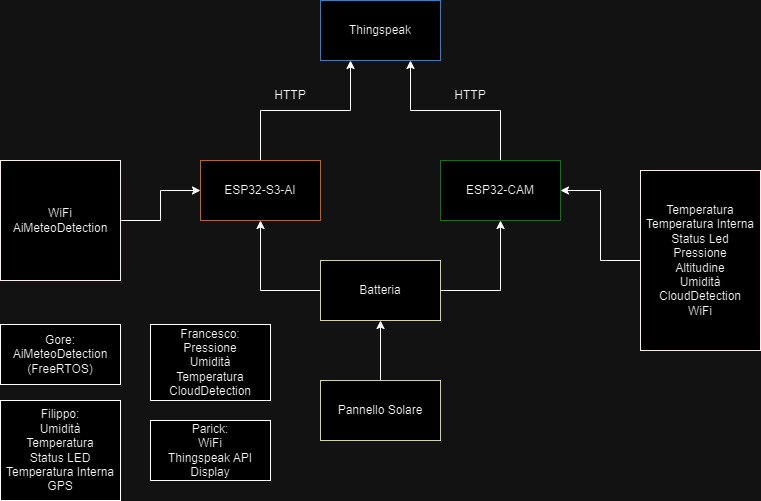
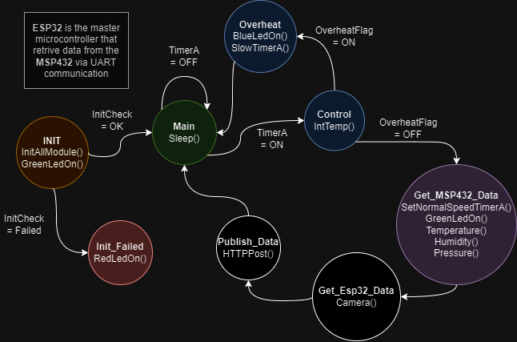

# Mobile Metherological Station
Organizing something outdoor near your home, with your friends and family can be somewhat frustating due to the unpredictability of the weather. What of a great opportunity to build a metherological station! \
Thanks to the versatility, portability and a budget-friendly price of embedded systems, you can build your own mobile station, put it in you yard and monitor the weather from your office with little money.
For this projecy we used the power of esp32, a microcontroller with an outstanding price/value ratio, capable of many things and buyable with as little as 12 euros. Then we opted for the espidf framework instead of the arduino one: this chioce was made on the basis of having more control of the station and this pro outweighted the con of having far less documentation than the latter. \
Now let's dig deeper into this project!

## Project Structure

## Project FSM

## Components and parts (hardware and software)
### Esp32-Cam  

### Esp32-S3 

## Layout della repo
Troveremo un'app che fa una schematizzazione ad albero della repo e la inseriremmo
## Installation
Come installare il necessario e far girare il tutto su pc, magari mettiamo la procedura solo per windows
## Getting Started
Spieghiamo a grandi linee il codice e come capire se si sta facendo tutto giusto
## Group divisions
(Terremo solo i nomi alla fine, se volete useremo username) \
Cerka Patrick : Wifi, ThingSpeak (API), Display \
Gore Stefan : AIMeteoDetection(FreeRTOS) \
Mattei Filippo : Humidity, Temperature, Led Status, Internal temperature, GPS  \
Pietri Francesco : Pressure, Temperature, Cloud Detection
