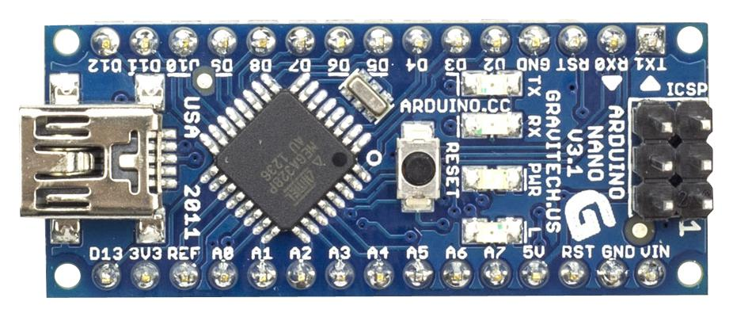

# Mobile Metherological Station
Organizing something outdoor near your home, with your friends and family can be somewhat frustating due to the unpredictability of the weather. What of a great opportunity to build a metherological station! \
Thanks to the versatility, portability and a budget-friendly price of embedded systems, you can build your own mobile station, put it in you yard and monitor the weather from your office with little money.
For this projecy we used the power of esp32, a microcontroller with an outstanding price/value ratio, capable of many things and buyable with as little as 12 euros. Then we opted for the espidf framework instead of the arduino one: this chioce was made on the basis of having more control of the station and this pro outweighted the con of having far less documentation than the latter. \
Our ultimate purpose is to build a light and cheap metherological station, simple to maintain and transport but also as accurate as possible, in order to be reliable and useful. \
Now let's dig deeper into this project!

## Project Structure

## Repository layout

## Components and parts (hardware and software)
### Software
You can use any IDE which suits you better but we as a team recommend using VSCode with the platformIO extension installed.

### Hardware
#### Pyrex bowl(to make the weather station waterproof)

#### Esp32-Cam(with a fish-eye cam)  

The EspCam requires a power source given that it has not any usb ports and also a serial interface to program the microcontroller \
We opted for an ARDUINO NANO which fits perfectly our purpose.

#### Esp32-S3 eye 

## Getting Started
### Creating a Project
Having installed the PlatformIO IDE extension, we need to open our project: you can do it by clicking on the PlatformIO extension, going in the QUICK ACCESS section e go to Projects & Configuration 

Here we need to click on Create New Project 

 

In the project wizard set these configurations and click finish 

 

Now you are ready for the coding!
### Through the code

## Group divisions
(Terremo solo i nomi alla fine, se volete useremo username) \
Cerka Patrick : Wifi, ThingSpeak (API), Display \
Gore Stefan : AIMeteoDetection(FreeRTOS) \
Mattei Filippo : Humidity, Temperature, Led Status, Internal temperature, GPS  \
Pietri Francesco : Pressure, Temperature, Cloud Detection
