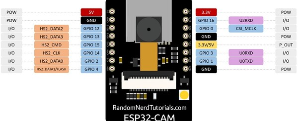

# Mobile Metherological Station
Organizing something outdoor near your home, with your friends and family can be somewhat frustating due to the unpredictability of the weather. What of a great opportunity to build a metherological station! \
Thanks to the versatility, portability and a budget-friendly price of embedded systems, you can build your own mobile station, put it in you yard and monitor the weather from your office with little money.
For this projecy we used the power of esp32, a microcontroller with an outstanding price/value ratio, capable of many things and buyable with as little as 12 euros. Then we opted for the espidf framework instead of the arduino one: this chioce was made on the basis of having more control of the station and this pro outweighted the con of having far less documentation than the latter. \
Our ultimate purpose is to build a light and cheap metherological station, simple to maintain and transport but also as accurate as possible, in order to be reliable and useful. We also built and implemented an experimental AI model to being able to classify the clouds tipology, for the moment. \
Now let's dig deeper into this project!

## Project Structure

## Repository layout

## Components and parts (hardware and software)
### Software
You can use any IDE which suits you better but we as a team recommend using VSCode with the platformIO extension installed.

### Hardware
#### Pyrex bowl(to make the weather station waterproof)

#### Esp32-Cam(with a fish-eye cam)  

The EspCam requires a power source given that it has not any usb ports and also a serial interface to program the microcontroller. \
We opted for an ARDUINO NANO which fits perfectly our purpose.

#### Esp32-S3 eye 

#### Sensors
BMP280 - temperature, pressure and altitude; \
DHT11 - Humidity; \
MQ135 - Smoke detector;

## Getting Started
### Creating a Project
Having installed the PlatformIO IDE extension, we need to open our project: you can do it by clicking on the PlatformIO extension, going in the QUICK ACCESS section e go to Projects & Configuration 

Here we need to click on Create New Project 

 

In the project wizard set these configurations and click finish 

 

Now you are ready for the coding!
### Building and flashing the project into the microcontrollers
On VSCode, having the project open, you can see a bar below with many functions. \
The two functions we need are the verify and upload, respectively the "tick" and the "arrow" \

 \

## Code

### Cloud Detection

We decided to use the integrated camera of the ESP32cam in order to create a simple and lightweight algorithm for the analysis of the sky above the weather station. The program returns the percentage of Sun, Sky, Cloud, Error (things that don't belong to the sky).

First of all, we took many pictures of the sky using an OV2640 fish eye camera installed on the ESP32cam under different types of weather and light conditions. Then, using a python program and the library OpenCV for image processing we estimated the HSV range for Cloud, Sun and Sky.

We used the HSV color space since it is more robust towards external lighting changes and is often used in computer vision and image processing instead of RGB.

Once the program in python was completed we created a lightweight version in C without  using open CV (way too heavy for our project).
Particularly, the C program takes a picture and saves it in a RGB565 standard and returns a pointer to the frame buffer of the image. Then, we access pixel by pixel using the pointer, we convert it in RGB888 and then we convert it in HSV (using the same ranges of OpenCV H: 0-180 S: 0-255 V: 0-255).

Once we have the HSV value of the pixel we just classifie it using the HSV ranges discovered using the python program. Eventually, when all 320x240 pixels are classified we calculate the relative percentage.

### BMP280:

General Specifications:
Operating Voltage: 1.71V to 3.6V
Operating Temperature: -40°C to 85°C.
Operating Pressure: 300hPa to 1100hPa.

Communication Protocol ESP32cam ←→ BMP280:
We decided to use the I2C protocol since it uses less wires than the SPI and provides an optimal speed and reliability for our application.
Even more, ESP32cam has a really poor number of GPIO pins and the default I2C pins are used by the camera, so we used the pins 14 (SCL) and 15 (SDA) by properly enabling the pull-up resistors.

The altitude is derived from the pressure using the international barometric formula, so it should be considered approssimative.
H = 44330 * [1 - (P/p0)^(1/5.255) ]

H = altitude (m)
P = measured pressure (Pa) from the sensor
p0 = reference pressure at sea level (e.g. 1013.25hPa, ajust it based on your location for higher precision)

Drivers Used:
https://github.com/UncleRus/esp-idf-lib

###DHT11:

## Group divisions
Cerka Patrick(0PkCk0) : Wifi, ThingSpeak (API), Repository \
Gore Stefan(StefanGore) : AIMeteoDetection, Display \
Mattei Filippo(FilippoMattei02) : Humidity, Air Quality, Led Status  \
Pietri Francesco(FrancescoPietri) : Pressure, Temperature, Altitude, Cloud Detection
